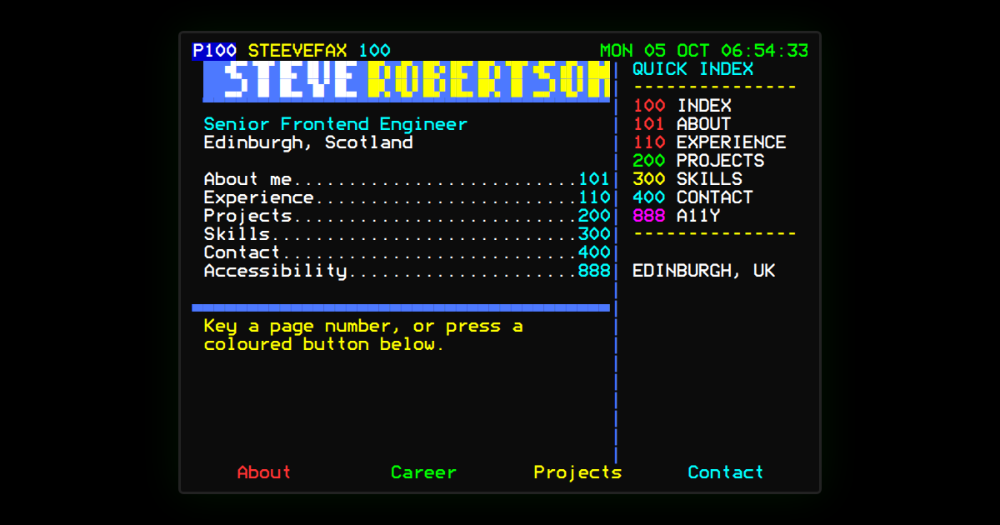

# Steevefax: Teletext Portfolio

Steve Robertson's developer portfolio, built as a Ceefax / ORACLE-style Teletext service: 3-digit page numbers, Fastext colour links, Mode 7 typography.

**Live:** https://steverobertson.dev/ · design system in [Storybook](https://steverobertson.dev/storybook/)



Every page is drawn on a real character grid in the Bedstead Mode 7 font, which changes shape with the screen: 56 × 24 with a quick index on widescreen, 40 × 24 on a 4:3 screen and 32 × 34 on a phone. Content is written once as JSON with colour tags and laid out at build time. Behind the grid, a semantic copy of each page (headings, lists and real links) serves screen readers, and page 888 switches to it as a plain Text mode.

## Getting started

Requires Node 22 (see `.nvmrc`).

```sh
npm ci
npm run dev        # http://localhost:5173
npm run storybook  # design system at http://localhost:6006
npm test           # unit tests (Vitest)
npm run validate   # check page content fits the grid
npm run typecheck
npm run lint
npm run build      # validate + typecheck + production build + pre-rendered pages
npm run test:e2e   # Playwright against the production build (see below)
```

### Playwright

`npm run test:e2e` builds the site with the GitHub Pages base, serves it with `vite preview` and runs the tests in `e2e/` at four screen sizes: navigation, axe (with colour contrast) and screenshots. Screenshot baselines come from CI's Linux image, so they won't match a local machine; after an intended visual change, run the **Update visual baselines** workflow on your branch (or push a commit whose message contains `[update baselines]`) and it commits new ones. To use an installed Chromium locally, set `PLAYWRIGHT_CHROMIUM` to its path.

## Updating the Flummox! questions

Flummox!, the quiz on page 152, reads its questions from `src/content/flummox/quiz.json` (format in [docs/flummox/SPEC.md](docs/flummox/SPEC.md) §7):

1. Edit the questions, answers, `correct` (0 red, 1 green, 2 yellow, 3 cyan), quips or verdicts.
2. For a new set of questions, change `edition`: everyone's best score starts again.
3. Run `npm run validate`. It checks the file and that every screen fits at every screen size, and names the question that doesn't.
4. If you changed a verdict, the link-preview pictures in `public/share/` are out of date and a test says so: run the **Update share images** workflow on your branch, or put `[update share images]` in a commit message. Locally, `npm run build-storybook && npm run share-images` redraws them.
5. Screenshots of page 152 change too: run **Update visual baselines** as above.

Felix's pictures are drawn by `/mnt/project-files/flummox/felix-art.mjs` outside the repo; the PNGs in `src/content/images/` are what the build uses.

## Deployment

Merging to `main` runs CI, and when it passes, `deploy.yml` builds the site with `GITHUB_PAGES=true` (base `/portfolio-website/`), pre-renders every page, builds Storybook into `/storybook/` and publishes to GitHub Pages. To serve it from a custom domain, set the repository variable `CUSTOM_DOMAIN` (e.g. `steverobertson.dev`) and add the same domain under Settings → Pages; the deploy then builds with `BASE_PATH=/` and `SITE_URL=https://<domain>`. With the variable unset it stays on `/portfolio-website/`. GitHub ignores a `CNAME` file when deploying from Actions, so there isn't one.

## Project layout

| Path | Purpose |
|---|---|
| `src/content/pages/*.json` | One file per Teletext page, written with colour tags (see SPEC §7) |
| `src/content/images/*.png` | Pictures turned into block graphics at build time (see [SPEC §8](docs/archive/steevefax-v1/SPEC.md)) |
| `src/content/` | Tag parser, wrapper, mosaic converter, semantic mirror builder, validator and the page registry |
| `src/display/` | Grid modes and screen layout |
| `src/components/` | Teletext UI components |
| `src/navigation/` | Routing, the shared 3-digit buffer and hotkeys |
| `src/settings/` | Saved Text mode, shortcut and CRT effect settings (page 888) |
| `src/content/flummox/` | Flummox! questions (`quiz.json`) and the screens laid out from them at build time |
| `src/flummox/` | The Flummox! game: rules, saved scores, Fastext and mirror, sharing, link-preview cards |
| `public/share/` | Flummox! link-preview pictures, made by `npm run share-images` |
| `scripts/` | `validatePages.ts`, the Vite plugin that compiles the pages, and `prerender.ts` (per-page HTML) |
| `e2e/` | Playwright tests, screenshot baselines and `shareImage.ts` (retakes `public/share.png`) |
| `src/design-system/` | Token stories and helpers |
| `public/fonts/` | Self-hosted Bedstead (CC0) |
| `docs/` | Feature docs; the finished v1 spec, roadmap, review and content brief are in `docs/archive/steevefax-v1/` |

## Docs

New feature docs live in [docs/](docs/README.md). The v1 docs are archived in [docs/archive/steevefax-v1](docs/archive/steevefax-v1/README.md):

- [SPEC.md](docs/archive/steevefax-v1/SPEC.md): requirements and decision log
- [ROADMAP.md](docs/archive/steevefax-v1/ROADMAP.md): phased delivery plan
- [REVIEW.md](docs/archive/steevefax-v1/REVIEW.md): review of the original build
- [CONTENT.md](docs/archive/steevefax-v1/CONTENT.md): content brief and approved page map
